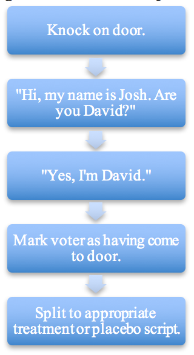

You will be helping *GROUP* implement a scientific experiment to measure the effects of your conversations. Executing this scientific experiment will require you to successfully implement a special canvassing procedure: the placebo design.

The goal of these placebo conversations is to _find out which voters you could have talked to_ had they been randomly assigned to receive the treatment conversation.

It’s _crucial_ that _nothing_ differs between the kinds of voters you mark as contacted in the placebo group and the treatment group. Here are a couple examples of how that might go wrong:

- Suppose when you’re delivering the treatment script you reveal up front that you’re canvassing for ISSUE. Voters who like ISSUE might more readily reveal that they’re your target. But, even if your conversations don’t change anyone’s mind, this would lead the voters you mark as contacted in the treatment group to be more pro-ISSUE than the voters you mark as contacted in the placebo group. Therefore, you must keep the beginning of the script identical in the treatment and placebo groups. *Only after you decide whether a voter counts as contacted or not can the scripts differ -- and therefore only then can you talk about ISSUE.*
- Suppose you try harder to reach voters in the treatment group than the placebo group. Voters that require more effort to start the conversation might be disproportionately present in the treatment group. If these voters tend to be less supportive, the voters you mark as contacted in the treatment group might be less supportive overall, making it look like your conversations were counterproductive! Therefore, it’s important you try equally hard to identify voters in the treatment and placebo groups.

As you canvass, you will be asked to record whether the voter listed on your walk list came to the door. As you begin interacting with the voter, your first task is to get the voter’s name. This should be done *before* you start talking about either the treatment (e.g., transgender discrimination) or the placebo (e.g., recycling). Once you get the voter’s name, they should be marked on your walk list as having come to the door. This is true whether the voter then immediately slams their door or whether you have a 20-minute conversation with the voter. 

*The below diagram reinforces how you should identify the voter and mark them as having come to the door before splitting to the treatment or placebo script.*

